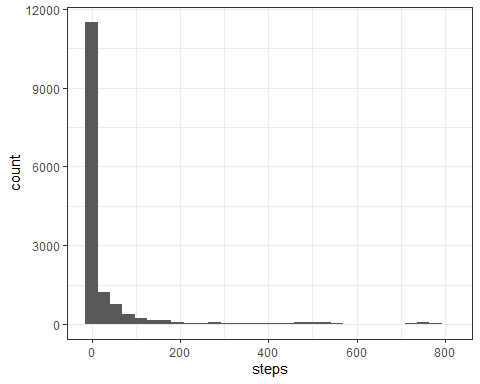
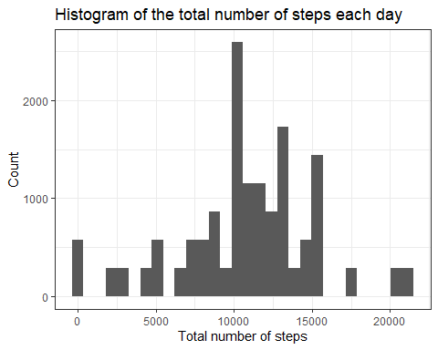
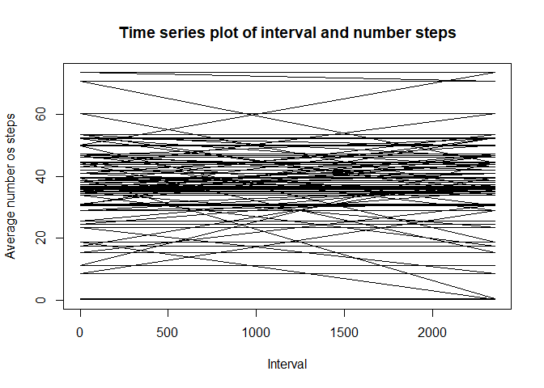
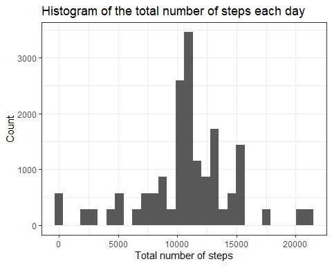
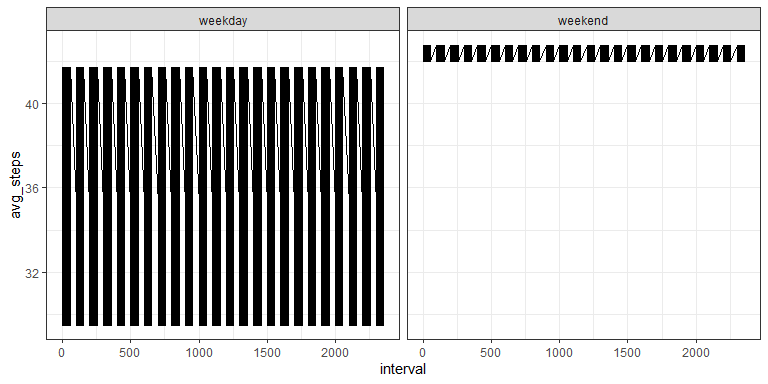

```r
library(tidyverse)      # Tidyverse for data manipulation
library(lubridate)     # Working with dates
library(knitr)        # Kniting
library(kableExtra)   # Printing nice tables
library(magrittr)     # 
```


## Loading and preprocessing the data


```
## # A tibble: 17,568 x 3
##    steps date       interval
##    <dbl> <date>        <dbl>
##  1    NA 2012-10-01        0
##  2    NA 2012-10-01        5
##  3    NA 2012-10-01       10
##  4    NA 2012-10-01       15
##  5    NA 2012-10-01       20
##  6    NA 2012-10-01       25
##  7    NA 2012-10-01       30
##  8    NA 2012-10-01       35
##  9    NA 2012-10-01       40
## 10    NA 2012-10-01       45
## # ... with 17,558 more rows
```

```
## Rows: 17,568
## Columns: 3
## $ steps    <dbl> NA, NA, NA, NA, NA, NA, NA, NA, NA, NA, NA, NA, NA, NA, NA...
## $ date     <date> 2012-10-01, 2012-10-01, 2012-10-01, 2012-10-01, 2012-10-0...
## $ interval <dbl> 0, 5, 10, 15, 20, 25, 30, 35, 40, 45, 50, 55, 100, 105, 11...
```

```
## [1] 17568     3
```

```
## # A tibble: 10 x 3
##    steps date       interval
##    <dbl> <date>        <dbl>
##  1     0 2012-11-12      200
##  2    NA 2012-11-01      720
##  3     0 2012-11-19     1025
##  4     0 2012-10-12     1800
##  5     0 2012-11-17     2335
##  6    23 2012-10-07      900
##  7     0 2012-11-05      135
##  8     0 2012-11-21      545
##  9     0 2012-11-08     1515
## 10     0 2012-10-11      535
```

```
##      steps             date               interval     
##  Min.   :  0.00   Min.   :2012-10-01   Min.   :   0.0  
##  1st Qu.:  0.00   1st Qu.:2012-10-16   1st Qu.: 588.8  
##  Median :  0.00   Median :2012-10-31   Median :1177.5  
##  Mean   : 37.38   Mean   :2012-10-31   Mean   :1177.5  
##  3rd Qu.: 12.00   3rd Qu.:2012-11-15   3rd Qu.:1766.2  
##  Max.   :806.00   Max.   :2012-11-30   Max.   :2355.0  
##  NA's   :2304
```

```
##    steps     date interval 
##     2304        0        0
```

```
## `stat_bin()` using `bins = 30`. Pick better value with `binwidth`.
```

```
## Warning: Removed 2304 rows containing non-finite values (stat_bin).
```

<!-- -->


## What is mean total number of steps taken per day?


```r
#-- Histogram of total number of steps taken each day
activity <- activity %>% 
  group_by(date) %>% 
  mutate(total_steps = sum(steps))

plot1 <- ggplot(activity, aes(total_steps)) + geom_histogram() + theme_bw()
plot1 <- plot1 + ggtitle("Histogram of the total number of steps each day") + xlab("Total number of steps") + ylab("Count")
plot1
```

```
## Warning: Removed 2304 rows containing non-finite values (stat_bin).
```

<!-- -->


```r
#--- Mean and median number of steps taken each day
activity %>% 
  group_by(date) %>% 
  summarise(
    mean_steps = mean(steps),
    median_steps = median(steps)
  ) %>% 
  kable() %>% 
  kable_styling() %>% 
  scroll_box(width = "500px", height = "500px")
```

<div style="border: 1px solid #ddd; padding: 0px; overflow-y: scroll; height:500px; overflow-x: scroll; width:500px; "><table class="table" style="margin-left: auto; margin-right: auto;">
 <thead>
  <tr>
   <th style="text-align:left;position: sticky; top:0; background-color: #FFFFFF;"> date </th>
   <th style="text-align:right;position: sticky; top:0; background-color: #FFFFFF;"> mean_steps </th>
   <th style="text-align:right;position: sticky; top:0; background-color: #FFFFFF;"> median_steps </th>
  </tr>
 </thead>
<tbody>
  <tr>
   <td style="text-align:left;"> 2012-10-01 </td>
   <td style="text-align:right;"> NA </td>
   <td style="text-align:right;"> NA </td>
  </tr>
  <tr>
   <td style="text-align:left;"> 2012-10-02 </td>
   <td style="text-align:right;"> 0.4375000 </td>
   <td style="text-align:right;"> 0 </td>
  </tr>
  <tr>
   <td style="text-align:left;"> 2012-10-03 </td>
   <td style="text-align:right;"> 39.4166667 </td>
   <td style="text-align:right;"> 0 </td>
  </tr>
  <tr>
   <td style="text-align:left;"> 2012-10-04 </td>
   <td style="text-align:right;"> 42.0694444 </td>
   <td style="text-align:right;"> 0 </td>
  </tr>
  <tr>
   <td style="text-align:left;"> 2012-10-05 </td>
   <td style="text-align:right;"> 46.1597222 </td>
   <td style="text-align:right;"> 0 </td>
  </tr>
  <tr>
   <td style="text-align:left;"> 2012-10-06 </td>
   <td style="text-align:right;"> 53.5416667 </td>
   <td style="text-align:right;"> 0 </td>
  </tr>
  <tr>
   <td style="text-align:left;"> 2012-10-07 </td>
   <td style="text-align:right;"> 38.2465278 </td>
   <td style="text-align:right;"> 0 </td>
  </tr>
  <tr>
   <td style="text-align:left;"> 2012-10-08 </td>
   <td style="text-align:right;"> NA </td>
   <td style="text-align:right;"> NA </td>
  </tr>
  <tr>
   <td style="text-align:left;"> 2012-10-09 </td>
   <td style="text-align:right;"> 44.4826389 </td>
   <td style="text-align:right;"> 0 </td>
  </tr>
  <tr>
   <td style="text-align:left;"> 2012-10-10 </td>
   <td style="text-align:right;"> 34.3750000 </td>
   <td style="text-align:right;"> 0 </td>
  </tr>
  <tr>
   <td style="text-align:left;"> 2012-10-11 </td>
   <td style="text-align:right;"> 35.7777778 </td>
   <td style="text-align:right;"> 0 </td>
  </tr>
  <tr>
   <td style="text-align:left;"> 2012-10-12 </td>
   <td style="text-align:right;"> 60.3541667 </td>
   <td style="text-align:right;"> 0 </td>
  </tr>
  <tr>
   <td style="text-align:left;"> 2012-10-13 </td>
   <td style="text-align:right;"> 43.1458333 </td>
   <td style="text-align:right;"> 0 </td>
  </tr>
  <tr>
   <td style="text-align:left;"> 2012-10-14 </td>
   <td style="text-align:right;"> 52.4236111 </td>
   <td style="text-align:right;"> 0 </td>
  </tr>
  <tr>
   <td style="text-align:left;"> 2012-10-15 </td>
   <td style="text-align:right;"> 35.2048611 </td>
   <td style="text-align:right;"> 0 </td>
  </tr>
  <tr>
   <td style="text-align:left;"> 2012-10-16 </td>
   <td style="text-align:right;"> 52.3750000 </td>
   <td style="text-align:right;"> 0 </td>
  </tr>
  <tr>
   <td style="text-align:left;"> 2012-10-17 </td>
   <td style="text-align:right;"> 46.7083333 </td>
   <td style="text-align:right;"> 0 </td>
  </tr>
  <tr>
   <td style="text-align:left;"> 2012-10-18 </td>
   <td style="text-align:right;"> 34.9166667 </td>
   <td style="text-align:right;"> 0 </td>
  </tr>
  <tr>
   <td style="text-align:left;"> 2012-10-19 </td>
   <td style="text-align:right;"> 41.0729167 </td>
   <td style="text-align:right;"> 0 </td>
  </tr>
  <tr>
   <td style="text-align:left;"> 2012-10-20 </td>
   <td style="text-align:right;"> 36.0937500 </td>
   <td style="text-align:right;"> 0 </td>
  </tr>
  <tr>
   <td style="text-align:left;"> 2012-10-21 </td>
   <td style="text-align:right;"> 30.6284722 </td>
   <td style="text-align:right;"> 0 </td>
  </tr>
  <tr>
   <td style="text-align:left;"> 2012-10-22 </td>
   <td style="text-align:right;"> 46.7361111 </td>
   <td style="text-align:right;"> 0 </td>
  </tr>
  <tr>
   <td style="text-align:left;"> 2012-10-23 </td>
   <td style="text-align:right;"> 30.9652778 </td>
   <td style="text-align:right;"> 0 </td>
  </tr>
  <tr>
   <td style="text-align:left;"> 2012-10-24 </td>
   <td style="text-align:right;"> 29.0104167 </td>
   <td style="text-align:right;"> 0 </td>
  </tr>
  <tr>
   <td style="text-align:left;"> 2012-10-25 </td>
   <td style="text-align:right;"> 8.6527778 </td>
   <td style="text-align:right;"> 0 </td>
  </tr>
  <tr>
   <td style="text-align:left;"> 2012-10-26 </td>
   <td style="text-align:right;"> 23.5347222 </td>
   <td style="text-align:right;"> 0 </td>
  </tr>
  <tr>
   <td style="text-align:left;"> 2012-10-27 </td>
   <td style="text-align:right;"> 35.1354167 </td>
   <td style="text-align:right;"> 0 </td>
  </tr>
  <tr>
   <td style="text-align:left;"> 2012-10-28 </td>
   <td style="text-align:right;"> 39.7847222 </td>
   <td style="text-align:right;"> 0 </td>
  </tr>
  <tr>
   <td style="text-align:left;"> 2012-10-29 </td>
   <td style="text-align:right;"> 17.4236111 </td>
   <td style="text-align:right;"> 0 </td>
  </tr>
  <tr>
   <td style="text-align:left;"> 2012-10-30 </td>
   <td style="text-align:right;"> 34.0937500 </td>
   <td style="text-align:right;"> 0 </td>
  </tr>
  <tr>
   <td style="text-align:left;"> 2012-10-31 </td>
   <td style="text-align:right;"> 53.5208333 </td>
   <td style="text-align:right;"> 0 </td>
  </tr>
  <tr>
   <td style="text-align:left;"> 2012-11-01 </td>
   <td style="text-align:right;"> NA </td>
   <td style="text-align:right;"> NA </td>
  </tr>
  <tr>
   <td style="text-align:left;"> 2012-11-02 </td>
   <td style="text-align:right;"> 36.8055556 </td>
   <td style="text-align:right;"> 0 </td>
  </tr>
  <tr>
   <td style="text-align:left;"> 2012-11-03 </td>
   <td style="text-align:right;"> 36.7048611 </td>
   <td style="text-align:right;"> 0 </td>
  </tr>
  <tr>
   <td style="text-align:left;"> 2012-11-04 </td>
   <td style="text-align:right;"> NA </td>
   <td style="text-align:right;"> NA </td>
  </tr>
  <tr>
   <td style="text-align:left;"> 2012-11-05 </td>
   <td style="text-align:right;"> 36.2465278 </td>
   <td style="text-align:right;"> 0 </td>
  </tr>
  <tr>
   <td style="text-align:left;"> 2012-11-06 </td>
   <td style="text-align:right;"> 28.9375000 </td>
   <td style="text-align:right;"> 0 </td>
  </tr>
  <tr>
   <td style="text-align:left;"> 2012-11-07 </td>
   <td style="text-align:right;"> 44.7326389 </td>
   <td style="text-align:right;"> 0 </td>
  </tr>
  <tr>
   <td style="text-align:left;"> 2012-11-08 </td>
   <td style="text-align:right;"> 11.1770833 </td>
   <td style="text-align:right;"> 0 </td>
  </tr>
  <tr>
   <td style="text-align:left;"> 2012-11-09 </td>
   <td style="text-align:right;"> NA </td>
   <td style="text-align:right;"> NA </td>
  </tr>
  <tr>
   <td style="text-align:left;"> 2012-11-10 </td>
   <td style="text-align:right;"> NA </td>
   <td style="text-align:right;"> NA </td>
  </tr>
  <tr>
   <td style="text-align:left;"> 2012-11-11 </td>
   <td style="text-align:right;"> 43.7777778 </td>
   <td style="text-align:right;"> 0 </td>
  </tr>
  <tr>
   <td style="text-align:left;"> 2012-11-12 </td>
   <td style="text-align:right;"> 37.3784722 </td>
   <td style="text-align:right;"> 0 </td>
  </tr>
  <tr>
   <td style="text-align:left;"> 2012-11-13 </td>
   <td style="text-align:right;"> 25.4722222 </td>
   <td style="text-align:right;"> 0 </td>
  </tr>
  <tr>
   <td style="text-align:left;"> 2012-11-14 </td>
   <td style="text-align:right;"> NA </td>
   <td style="text-align:right;"> NA </td>
  </tr>
  <tr>
   <td style="text-align:left;"> 2012-11-15 </td>
   <td style="text-align:right;"> 0.1423611 </td>
   <td style="text-align:right;"> 0 </td>
  </tr>
  <tr>
   <td style="text-align:left;"> 2012-11-16 </td>
   <td style="text-align:right;"> 18.8923611 </td>
   <td style="text-align:right;"> 0 </td>
  </tr>
  <tr>
   <td style="text-align:left;"> 2012-11-17 </td>
   <td style="text-align:right;"> 49.7881944 </td>
   <td style="text-align:right;"> 0 </td>
  </tr>
  <tr>
   <td style="text-align:left;"> 2012-11-18 </td>
   <td style="text-align:right;"> 52.4652778 </td>
   <td style="text-align:right;"> 0 </td>
  </tr>
  <tr>
   <td style="text-align:left;"> 2012-11-19 </td>
   <td style="text-align:right;"> 30.6979167 </td>
   <td style="text-align:right;"> 0 </td>
  </tr>
  <tr>
   <td style="text-align:left;"> 2012-11-20 </td>
   <td style="text-align:right;"> 15.5277778 </td>
   <td style="text-align:right;"> 0 </td>
  </tr>
  <tr>
   <td style="text-align:left;"> 2012-11-21 </td>
   <td style="text-align:right;"> 44.3993056 </td>
   <td style="text-align:right;"> 0 </td>
  </tr>
  <tr>
   <td style="text-align:left;"> 2012-11-22 </td>
   <td style="text-align:right;"> 70.9270833 </td>
   <td style="text-align:right;"> 0 </td>
  </tr>
  <tr>
   <td style="text-align:left;"> 2012-11-23 </td>
   <td style="text-align:right;"> 73.5902778 </td>
   <td style="text-align:right;"> 0 </td>
  </tr>
  <tr>
   <td style="text-align:left;"> 2012-11-24 </td>
   <td style="text-align:right;"> 50.2708333 </td>
   <td style="text-align:right;"> 0 </td>
  </tr>
  <tr>
   <td style="text-align:left;"> 2012-11-25 </td>
   <td style="text-align:right;"> 41.0902778 </td>
   <td style="text-align:right;"> 0 </td>
  </tr>
  <tr>
   <td style="text-align:left;"> 2012-11-26 </td>
   <td style="text-align:right;"> 38.7569444 </td>
   <td style="text-align:right;"> 0 </td>
  </tr>
  <tr>
   <td style="text-align:left;"> 2012-11-27 </td>
   <td style="text-align:right;"> 47.3819444 </td>
   <td style="text-align:right;"> 0 </td>
  </tr>
  <tr>
   <td style="text-align:left;"> 2012-11-28 </td>
   <td style="text-align:right;"> 35.3576389 </td>
   <td style="text-align:right;"> 0 </td>
  </tr>
  <tr>
   <td style="text-align:left;"> 2012-11-29 </td>
   <td style="text-align:right;"> 24.4687500 </td>
   <td style="text-align:right;"> 0 </td>
  </tr>
  <tr>
   <td style="text-align:left;"> 2012-11-30 </td>
   <td style="text-align:right;"> NA </td>
   <td style="text-align:right;"> NA </td>
  </tr>
</tbody>
</table></div>


## What is the average daily activity pattern?


```r
#--- Calculate the average number of steps per day

activity <- activity %>% 
  group_by(date) %>% 
  mutate(avg_steps = mean(steps))
#---- Plot the time interval(x axis) and avg_steps(y)


plot2 <- plot(activity$interval, activity$avg_steps, type = 'l',
              main = "Time series plot of interval and number steps",
              xlab = "Interval",
              ylab = "Average number os steps")
```

<!-- -->


```r
#--- The 5-minute interval that, on average, contains the maximum number of steps
activity %>% 
  group_by(date) %>% 
  mutate(max_steps =max(steps)) %>% 
  select(interval, max_steps, steps) %>% 
  filter(!is.na(max_steps)) %>% 
  arrange(desc(steps)) %>% 
  distinct(date, max_steps, .keep_all = T) %>% 
  kable() %>% 
  kable_styling() %>% 
  scroll_box(width = "500px", height = "500px")
```

<div style="border: 1px solid #ddd; padding: 0px; overflow-y: scroll; height:500px; overflow-x: scroll; width:500px; "><table class="table" style="margin-left: auto; margin-right: auto;">
 <thead>
  <tr>
   <th style="text-align:left;position: sticky; top:0; background-color: #FFFFFF;"> date </th>
   <th style="text-align:right;position: sticky; top:0; background-color: #FFFFFF;"> interval </th>
   <th style="text-align:right;position: sticky; top:0; background-color: #FFFFFF;"> max_steps </th>
   <th style="text-align:right;position: sticky; top:0; background-color: #FFFFFF;"> steps </th>
  </tr>
 </thead>
<tbody>
  <tr>
   <td style="text-align:left;"> 2012-11-27 </td>
   <td style="text-align:right;"> 615 </td>
   <td style="text-align:right;"> 806 </td>
   <td style="text-align:right;"> 806 </td>
  </tr>
  <tr>
   <td style="text-align:left;"> 2012-10-12 </td>
   <td style="text-align:right;"> 900 </td>
   <td style="text-align:right;"> 802 </td>
   <td style="text-align:right;"> 802 </td>
  </tr>
  <tr>
   <td style="text-align:left;"> 2012-11-19 </td>
   <td style="text-align:right;"> 720 </td>
   <td style="text-align:right;"> 789 </td>
   <td style="text-align:right;"> 789 </td>
  </tr>
  <tr>
   <td style="text-align:left;"> 2012-10-15 </td>
   <td style="text-align:right;"> 835 </td>
   <td style="text-align:right;"> 786 </td>
   <td style="text-align:right;"> 786 </td>
  </tr>
  <tr>
   <td style="text-align:left;"> 2012-11-05 </td>
   <td style="text-align:right;"> 925 </td>
   <td style="text-align:right;"> 785 </td>
   <td style="text-align:right;"> 785 </td>
  </tr>
  <tr>
   <td style="text-align:left;"> 2012-11-18 </td>
   <td style="text-align:right;"> 1635 </td>
   <td style="text-align:right;"> 785 </td>
   <td style="text-align:right;"> 785 </td>
  </tr>
  <tr>
   <td style="text-align:left;"> 2012-11-24 </td>
   <td style="text-align:right;"> 1600 </td>
   <td style="text-align:right;"> 785 </td>
   <td style="text-align:right;"> 785 </td>
  </tr>
  <tr>
   <td style="text-align:left;"> 2012-10-22 </td>
   <td style="text-align:right;"> 1140 </td>
   <td style="text-align:right;"> 783 </td>
   <td style="text-align:right;"> 783 </td>
  </tr>
  <tr>
   <td style="text-align:left;"> 2012-11-07 </td>
   <td style="text-align:right;"> 850 </td>
   <td style="text-align:right;"> 766 </td>
   <td style="text-align:right;"> 766 </td>
  </tr>
  <tr>
   <td style="text-align:left;"> 2012-11-23 </td>
   <td style="text-align:right;"> 1520 </td>
   <td style="text-align:right;"> 760 </td>
   <td style="text-align:right;"> 760 </td>
  </tr>
  <tr>
   <td style="text-align:left;"> 2012-10-18 </td>
   <td style="text-align:right;"> 815 </td>
   <td style="text-align:right;"> 759 </td>
   <td style="text-align:right;"> 759 </td>
  </tr>
  <tr>
   <td style="text-align:left;"> 2012-10-16 </td>
   <td style="text-align:right;"> 815 </td>
   <td style="text-align:right;"> 758 </td>
   <td style="text-align:right;"> 758 </td>
  </tr>
  <tr>
   <td style="text-align:left;"> 2012-11-21 </td>
   <td style="text-align:right;"> 830 </td>
   <td style="text-align:right;"> 758 </td>
   <td style="text-align:right;"> 758 </td>
  </tr>
  <tr>
   <td style="text-align:left;"> 2012-10-31 </td>
   <td style="text-align:right;"> 730 </td>
   <td style="text-align:right;"> 757 </td>
   <td style="text-align:right;"> 757 </td>
  </tr>
  <tr>
   <td style="text-align:left;"> 2012-11-02 </td>
   <td style="text-align:right;"> 815 </td>
   <td style="text-align:right;"> 753 </td>
   <td style="text-align:right;"> 753 </td>
  </tr>
  <tr>
   <td style="text-align:left;"> 2012-11-17 </td>
   <td style="text-align:right;"> 1710 </td>
   <td style="text-align:right;"> 753 </td>
   <td style="text-align:right;"> 753 </td>
  </tr>
  <tr>
   <td style="text-align:left;"> 2012-10-09 </td>
   <td style="text-align:right;"> 810 </td>
   <td style="text-align:right;"> 748 </td>
   <td style="text-align:right;"> 748 </td>
  </tr>
  <tr>
   <td style="text-align:left;"> 2012-10-11 </td>
   <td style="text-align:right;"> 825 </td>
   <td style="text-align:right;"> 748 </td>
   <td style="text-align:right;"> 748 </td>
  </tr>
  <tr>
   <td style="text-align:left;"> 2012-10-17 </td>
   <td style="text-align:right;"> 830 </td>
   <td style="text-align:right;"> 744 </td>
   <td style="text-align:right;"> 744 </td>
  </tr>
  <tr>
   <td style="text-align:left;"> 2012-11-28 </td>
   <td style="text-align:right;"> 610 </td>
   <td style="text-align:right;"> 733 </td>
   <td style="text-align:right;"> 733 </td>
  </tr>
  <tr>
   <td style="text-align:left;"> 2012-11-26 </td>
   <td style="text-align:right;"> 550 </td>
   <td style="text-align:right;"> 709 </td>
   <td style="text-align:right;"> 709 </td>
  </tr>
  <tr>
   <td style="text-align:left;"> 2012-11-06 </td>
   <td style="text-align:right;"> 750 </td>
   <td style="text-align:right;"> 630 </td>
   <td style="text-align:right;"> 630 </td>
  </tr>
  <tr>
   <td style="text-align:left;"> 2012-10-03 </td>
   <td style="text-align:right;"> 620 </td>
   <td style="text-align:right;"> 613 </td>
   <td style="text-align:right;"> 613 </td>
  </tr>
  <tr>
   <td style="text-align:left;"> 2012-10-29 </td>
   <td style="text-align:right;"> 2050 </td>
   <td style="text-align:right;"> 591 </td>
   <td style="text-align:right;"> 591 </td>
  </tr>
  <tr>
   <td style="text-align:left;"> 2012-11-29 </td>
   <td style="text-align:right;"> 925 </td>
   <td style="text-align:right;"> 568 </td>
   <td style="text-align:right;"> 568 </td>
  </tr>
  <tr>
   <td style="text-align:left;"> 2012-11-22 </td>
   <td style="text-align:right;"> 1935 </td>
   <td style="text-align:right;"> 567 </td>
   <td style="text-align:right;"> 567 </td>
  </tr>
  <tr>
   <td style="text-align:left;"> 2012-10-05 </td>
   <td style="text-align:right;"> 1210 </td>
   <td style="text-align:right;"> 555 </td>
   <td style="text-align:right;"> 555 </td>
  </tr>
  <tr>
   <td style="text-align:left;"> 2012-10-27 </td>
   <td style="text-align:right;"> 915 </td>
   <td style="text-align:right;"> 555 </td>
   <td style="text-align:right;"> 555 </td>
  </tr>
  <tr>
   <td style="text-align:left;"> 2012-11-25 </td>
   <td style="text-align:right;"> 1035 </td>
   <td style="text-align:right;"> 551 </td>
   <td style="text-align:right;"> 551 </td>
  </tr>
  <tr>
   <td style="text-align:left;"> 2012-10-04 </td>
   <td style="text-align:right;"> 1815 </td>
   <td style="text-align:right;"> 547 </td>
   <td style="text-align:right;"> 547 </td>
  </tr>
  <tr>
   <td style="text-align:left;"> 2012-10-13 </td>
   <td style="text-align:right;"> 850 </td>
   <td style="text-align:right;"> 542 </td>
   <td style="text-align:right;"> 542 </td>
  </tr>
  <tr>
   <td style="text-align:left;"> 2012-11-12 </td>
   <td style="text-align:right;"> 855 </td>
   <td style="text-align:right;"> 542 </td>
   <td style="text-align:right;"> 542 </td>
  </tr>
  <tr>
   <td style="text-align:left;"> 2012-10-14 </td>
   <td style="text-align:right;"> 1035 </td>
   <td style="text-align:right;"> 540 </td>
   <td style="text-align:right;"> 540 </td>
  </tr>
  <tr>
   <td style="text-align:left;"> 2012-11-11 </td>
   <td style="text-align:right;"> 1310 </td>
   <td style="text-align:right;"> 540 </td>
   <td style="text-align:right;"> 540 </td>
  </tr>
  <tr>
   <td style="text-align:left;"> 2012-10-24 </td>
   <td style="text-align:right;"> 1900 </td>
   <td style="text-align:right;"> 533 </td>
   <td style="text-align:right;"> 533 </td>
  </tr>
  <tr>
   <td style="text-align:left;"> 2012-10-28 </td>
   <td style="text-align:right;"> 815 </td>
   <td style="text-align:right;"> 533 </td>
   <td style="text-align:right;"> 533 </td>
  </tr>
  <tr>
   <td style="text-align:left;"> 2012-11-03 </td>
   <td style="text-align:right;"> 925 </td>
   <td style="text-align:right;"> 533 </td>
   <td style="text-align:right;"> 533 </td>
  </tr>
  <tr>
   <td style="text-align:left;"> 2012-10-20 </td>
   <td style="text-align:right;"> 2025 </td>
   <td style="text-align:right;"> 532 </td>
   <td style="text-align:right;"> 532 </td>
  </tr>
  <tr>
   <td style="text-align:left;"> 2012-10-06 </td>
   <td style="text-align:right;"> 1840 </td>
   <td style="text-align:right;"> 526 </td>
   <td style="text-align:right;"> 526 </td>
  </tr>
  <tr>
   <td style="text-align:left;"> 2012-10-07 </td>
   <td style="text-align:right;"> 1710 </td>
   <td style="text-align:right;"> 523 </td>
   <td style="text-align:right;"> 523 </td>
  </tr>
  <tr>
   <td style="text-align:left;"> 2012-10-30 </td>
   <td style="text-align:right;"> 1835 </td>
   <td style="text-align:right;"> 523 </td>
   <td style="text-align:right;"> 523 </td>
  </tr>
  <tr>
   <td style="text-align:left;"> 2012-10-19 </td>
   <td style="text-align:right;"> 1825 </td>
   <td style="text-align:right;"> 512 </td>
   <td style="text-align:right;"> 512 </td>
  </tr>
  <tr>
   <td style="text-align:left;"> 2012-10-21 </td>
   <td style="text-align:right;"> 2020 </td>
   <td style="text-align:right;"> 501 </td>
   <td style="text-align:right;"> 501 </td>
  </tr>
  <tr>
   <td style="text-align:left;"> 2012-11-20 </td>
   <td style="text-align:right;"> 855 </td>
   <td style="text-align:right;"> 500 </td>
   <td style="text-align:right;"> 500 </td>
  </tr>
  <tr>
   <td style="text-align:left;"> 2012-10-23 </td>
   <td style="text-align:right;"> 1200 </td>
   <td style="text-align:right;"> 499 </td>
   <td style="text-align:right;"> 499 </td>
  </tr>
  <tr>
   <td style="text-align:left;"> 2012-11-16 </td>
   <td style="text-align:right;"> 1025 </td>
   <td style="text-align:right;"> 475 </td>
   <td style="text-align:right;"> 475 </td>
  </tr>
  <tr>
   <td style="text-align:left;"> 2012-11-13 </td>
   <td style="text-align:right;"> 1215 </td>
   <td style="text-align:right;"> 444 </td>
   <td style="text-align:right;"> 444 </td>
  </tr>
  <tr>
   <td style="text-align:left;"> 2012-10-25 </td>
   <td style="text-align:right;"> 1950 </td>
   <td style="text-align:right;"> 443 </td>
   <td style="text-align:right;"> 443 </td>
  </tr>
  <tr>
   <td style="text-align:left;"> 2012-10-26 </td>
   <td style="text-align:right;"> 850 </td>
   <td style="text-align:right;"> 440 </td>
   <td style="text-align:right;"> 440 </td>
  </tr>
  <tr>
   <td style="text-align:left;"> 2012-10-10 </td>
   <td style="text-align:right;"> 1205 </td>
   <td style="text-align:right;"> 413 </td>
   <td style="text-align:right;"> 413 </td>
  </tr>
  <tr>
   <td style="text-align:left;"> 2012-11-08 </td>
   <td style="text-align:right;"> 1550 </td>
   <td style="text-align:right;"> 359 </td>
   <td style="text-align:right;"> 359 </td>
  </tr>
  <tr>
   <td style="text-align:left;"> 2012-10-02 </td>
   <td style="text-align:right;"> 2210 </td>
   <td style="text-align:right;"> 117 </td>
   <td style="text-align:right;"> 117 </td>
  </tr>
  <tr>
   <td style="text-align:left;"> 2012-11-15 </td>
   <td style="text-align:right;"> 325 </td>
   <td style="text-align:right;"> 33 </td>
   <td style="text-align:right;"> 33 </td>
  </tr>
</tbody>
</table></div>


## Imputing missing values


```r
#--- Impute missing for each day using mean 
activity_nomissing <-  activity%>% 
  group_by(date) %>% 
  mutate(steps = replace(steps,
                         is.na(steps), mean(steps, na.rm = T)),
         interval = replace(interval,
                         is.na(interval), mean(interval, na.rm = T))) %>% ungroup()

#--- For the remaining missing impute for the whole dataset
activity_nomissing <-  activity_nomissing %>% 
  mutate(steps = replace(steps,
                         is.na(steps), mean(steps, na.rm = T))) %>% 
  select(-avg_steps)

#--- Check both datasets
summary(activity_nomissing)
```

```
##      steps             date               interval       total_steps   
##  Min.   :  0.00   Min.   :2012-10-01   Min.   :   0.0   Min.   :   41  
##  1st Qu.:  0.00   1st Qu.:2012-10-16   1st Qu.: 588.8   1st Qu.: 8841  
##  Median :  0.00   Median :2012-10-31   Median :1177.5   Median :10765  
##  Mean   : 37.38   Mean   :2012-10-31   Mean   :1177.5   Mean   :10766  
##  3rd Qu.: 37.38   3rd Qu.:2012-11-15   3rd Qu.:1766.2   3rd Qu.:13294  
##  Max.   :806.00   Max.   :2012-11-30   Max.   :2355.0   Max.   :21194  
##                                                         NA's   :2304
```

```r
summary(activity)
```

```
##      steps             date               interval       total_steps   
##  Min.   :  0.00   Min.   :2012-10-01   Min.   :   0.0   Min.   :   41  
##  1st Qu.:  0.00   1st Qu.:2012-10-16   1st Qu.: 588.8   1st Qu.: 8841  
##  Median :  0.00   Median :2012-10-31   Median :1177.5   Median :10765  
##  Mean   : 37.38   Mean   :2012-10-31   Mean   :1177.5   Mean   :10766  
##  3rd Qu.: 12.00   3rd Qu.:2012-11-15   3rd Qu.:1766.2   3rd Qu.:13294  
##  Max.   :806.00   Max.   :2012-11-30   Max.   :2355.0   Max.   :21194  
##  NA's   :2304                                           NA's   :2304   
##    avg_steps      
##  Min.   : 0.1424  
##  1st Qu.:30.6979  
##  Median :37.3785  
##  Mean   :37.3826  
##  3rd Qu.:46.1597  
##  Max.   :73.5903  
##  NA's   :2304
```


```r
activity_nomissing <- activity_nomissing %>% 
  group_by(date) %>% 
  mutate(total_steps = sum(steps))

plot3 <- ggplot(activity_nomissing, aes(total_steps)) + geom_histogram() + theme_bw()
plot3 <- plot3 + ggtitle("Histogram of the total number of steps each day") + xlab("Total number of steps") + ylab("Count")
plot3
```

<!-- -->


```r
activity_nomissing %>% 
  group_by(date) %>% 
  summarise(
    mean_steps = mean(steps),
    median_steps = median(steps)
  ) %>% 
  kable() %>% 
  kable_styling() %>% 
  scroll_box(width = "500px", height = "500px")
```

<div style="border: 1px solid #ddd; padding: 0px; overflow-y: scroll; height:500px; overflow-x: scroll; width:500px; "><table class="table" style="margin-left: auto; margin-right: auto;">
 <thead>
  <tr>
   <th style="text-align:left;position: sticky; top:0; background-color: #FFFFFF;"> date </th>
   <th style="text-align:right;position: sticky; top:0; background-color: #FFFFFF;"> mean_steps </th>
   <th style="text-align:right;position: sticky; top:0; background-color: #FFFFFF;"> median_steps </th>
  </tr>
 </thead>
<tbody>
  <tr>
   <td style="text-align:left;"> 2012-10-01 </td>
   <td style="text-align:right;"> 37.3825996 </td>
   <td style="text-align:right;"> 37.3826 </td>
  </tr>
  <tr>
   <td style="text-align:left;"> 2012-10-02 </td>
   <td style="text-align:right;"> 0.4375000 </td>
   <td style="text-align:right;"> 0.0000 </td>
  </tr>
  <tr>
   <td style="text-align:left;"> 2012-10-03 </td>
   <td style="text-align:right;"> 39.4166667 </td>
   <td style="text-align:right;"> 0.0000 </td>
  </tr>
  <tr>
   <td style="text-align:left;"> 2012-10-04 </td>
   <td style="text-align:right;"> 42.0694444 </td>
   <td style="text-align:right;"> 0.0000 </td>
  </tr>
  <tr>
   <td style="text-align:left;"> 2012-10-05 </td>
   <td style="text-align:right;"> 46.1597222 </td>
   <td style="text-align:right;"> 0.0000 </td>
  </tr>
  <tr>
   <td style="text-align:left;"> 2012-10-06 </td>
   <td style="text-align:right;"> 53.5416667 </td>
   <td style="text-align:right;"> 0.0000 </td>
  </tr>
  <tr>
   <td style="text-align:left;"> 2012-10-07 </td>
   <td style="text-align:right;"> 38.2465278 </td>
   <td style="text-align:right;"> 0.0000 </td>
  </tr>
  <tr>
   <td style="text-align:left;"> 2012-10-08 </td>
   <td style="text-align:right;"> 37.3825996 </td>
   <td style="text-align:right;"> 37.3826 </td>
  </tr>
  <tr>
   <td style="text-align:left;"> 2012-10-09 </td>
   <td style="text-align:right;"> 44.4826389 </td>
   <td style="text-align:right;"> 0.0000 </td>
  </tr>
  <tr>
   <td style="text-align:left;"> 2012-10-10 </td>
   <td style="text-align:right;"> 34.3750000 </td>
   <td style="text-align:right;"> 0.0000 </td>
  </tr>
  <tr>
   <td style="text-align:left;"> 2012-10-11 </td>
   <td style="text-align:right;"> 35.7777778 </td>
   <td style="text-align:right;"> 0.0000 </td>
  </tr>
  <tr>
   <td style="text-align:left;"> 2012-10-12 </td>
   <td style="text-align:right;"> 60.3541667 </td>
   <td style="text-align:right;"> 0.0000 </td>
  </tr>
  <tr>
   <td style="text-align:left;"> 2012-10-13 </td>
   <td style="text-align:right;"> 43.1458333 </td>
   <td style="text-align:right;"> 0.0000 </td>
  </tr>
  <tr>
   <td style="text-align:left;"> 2012-10-14 </td>
   <td style="text-align:right;"> 52.4236111 </td>
   <td style="text-align:right;"> 0.0000 </td>
  </tr>
  <tr>
   <td style="text-align:left;"> 2012-10-15 </td>
   <td style="text-align:right;"> 35.2048611 </td>
   <td style="text-align:right;"> 0.0000 </td>
  </tr>
  <tr>
   <td style="text-align:left;"> 2012-10-16 </td>
   <td style="text-align:right;"> 52.3750000 </td>
   <td style="text-align:right;"> 0.0000 </td>
  </tr>
  <tr>
   <td style="text-align:left;"> 2012-10-17 </td>
   <td style="text-align:right;"> 46.7083333 </td>
   <td style="text-align:right;"> 0.0000 </td>
  </tr>
  <tr>
   <td style="text-align:left;"> 2012-10-18 </td>
   <td style="text-align:right;"> 34.9166667 </td>
   <td style="text-align:right;"> 0.0000 </td>
  </tr>
  <tr>
   <td style="text-align:left;"> 2012-10-19 </td>
   <td style="text-align:right;"> 41.0729167 </td>
   <td style="text-align:right;"> 0.0000 </td>
  </tr>
  <tr>
   <td style="text-align:left;"> 2012-10-20 </td>
   <td style="text-align:right;"> 36.0937500 </td>
   <td style="text-align:right;"> 0.0000 </td>
  </tr>
  <tr>
   <td style="text-align:left;"> 2012-10-21 </td>
   <td style="text-align:right;"> 30.6284722 </td>
   <td style="text-align:right;"> 0.0000 </td>
  </tr>
  <tr>
   <td style="text-align:left;"> 2012-10-22 </td>
   <td style="text-align:right;"> 46.7361111 </td>
   <td style="text-align:right;"> 0.0000 </td>
  </tr>
  <tr>
   <td style="text-align:left;"> 2012-10-23 </td>
   <td style="text-align:right;"> 30.9652778 </td>
   <td style="text-align:right;"> 0.0000 </td>
  </tr>
  <tr>
   <td style="text-align:left;"> 2012-10-24 </td>
   <td style="text-align:right;"> 29.0104167 </td>
   <td style="text-align:right;"> 0.0000 </td>
  </tr>
  <tr>
   <td style="text-align:left;"> 2012-10-25 </td>
   <td style="text-align:right;"> 8.6527778 </td>
   <td style="text-align:right;"> 0.0000 </td>
  </tr>
  <tr>
   <td style="text-align:left;"> 2012-10-26 </td>
   <td style="text-align:right;"> 23.5347222 </td>
   <td style="text-align:right;"> 0.0000 </td>
  </tr>
  <tr>
   <td style="text-align:left;"> 2012-10-27 </td>
   <td style="text-align:right;"> 35.1354167 </td>
   <td style="text-align:right;"> 0.0000 </td>
  </tr>
  <tr>
   <td style="text-align:left;"> 2012-10-28 </td>
   <td style="text-align:right;"> 39.7847222 </td>
   <td style="text-align:right;"> 0.0000 </td>
  </tr>
  <tr>
   <td style="text-align:left;"> 2012-10-29 </td>
   <td style="text-align:right;"> 17.4236111 </td>
   <td style="text-align:right;"> 0.0000 </td>
  </tr>
  <tr>
   <td style="text-align:left;"> 2012-10-30 </td>
   <td style="text-align:right;"> 34.0937500 </td>
   <td style="text-align:right;"> 0.0000 </td>
  </tr>
  <tr>
   <td style="text-align:left;"> 2012-10-31 </td>
   <td style="text-align:right;"> 53.5208333 </td>
   <td style="text-align:right;"> 0.0000 </td>
  </tr>
  <tr>
   <td style="text-align:left;"> 2012-11-01 </td>
   <td style="text-align:right;"> 37.3825996 </td>
   <td style="text-align:right;"> 37.3826 </td>
  </tr>
  <tr>
   <td style="text-align:left;"> 2012-11-02 </td>
   <td style="text-align:right;"> 36.8055556 </td>
   <td style="text-align:right;"> 0.0000 </td>
  </tr>
  <tr>
   <td style="text-align:left;"> 2012-11-03 </td>
   <td style="text-align:right;"> 36.7048611 </td>
   <td style="text-align:right;"> 0.0000 </td>
  </tr>
  <tr>
   <td style="text-align:left;"> 2012-11-04 </td>
   <td style="text-align:right;"> 37.3825996 </td>
   <td style="text-align:right;"> 37.3826 </td>
  </tr>
  <tr>
   <td style="text-align:left;"> 2012-11-05 </td>
   <td style="text-align:right;"> 36.2465278 </td>
   <td style="text-align:right;"> 0.0000 </td>
  </tr>
  <tr>
   <td style="text-align:left;"> 2012-11-06 </td>
   <td style="text-align:right;"> 28.9375000 </td>
   <td style="text-align:right;"> 0.0000 </td>
  </tr>
  <tr>
   <td style="text-align:left;"> 2012-11-07 </td>
   <td style="text-align:right;"> 44.7326389 </td>
   <td style="text-align:right;"> 0.0000 </td>
  </tr>
  <tr>
   <td style="text-align:left;"> 2012-11-08 </td>
   <td style="text-align:right;"> 11.1770833 </td>
   <td style="text-align:right;"> 0.0000 </td>
  </tr>
  <tr>
   <td style="text-align:left;"> 2012-11-09 </td>
   <td style="text-align:right;"> 37.3825996 </td>
   <td style="text-align:right;"> 37.3826 </td>
  </tr>
  <tr>
   <td style="text-align:left;"> 2012-11-10 </td>
   <td style="text-align:right;"> 37.3825996 </td>
   <td style="text-align:right;"> 37.3826 </td>
  </tr>
  <tr>
   <td style="text-align:left;"> 2012-11-11 </td>
   <td style="text-align:right;"> 43.7777778 </td>
   <td style="text-align:right;"> 0.0000 </td>
  </tr>
  <tr>
   <td style="text-align:left;"> 2012-11-12 </td>
   <td style="text-align:right;"> 37.3784722 </td>
   <td style="text-align:right;"> 0.0000 </td>
  </tr>
  <tr>
   <td style="text-align:left;"> 2012-11-13 </td>
   <td style="text-align:right;"> 25.4722222 </td>
   <td style="text-align:right;"> 0.0000 </td>
  </tr>
  <tr>
   <td style="text-align:left;"> 2012-11-14 </td>
   <td style="text-align:right;"> 37.3825996 </td>
   <td style="text-align:right;"> 37.3826 </td>
  </tr>
  <tr>
   <td style="text-align:left;"> 2012-11-15 </td>
   <td style="text-align:right;"> 0.1423611 </td>
   <td style="text-align:right;"> 0.0000 </td>
  </tr>
  <tr>
   <td style="text-align:left;"> 2012-11-16 </td>
   <td style="text-align:right;"> 18.8923611 </td>
   <td style="text-align:right;"> 0.0000 </td>
  </tr>
  <tr>
   <td style="text-align:left;"> 2012-11-17 </td>
   <td style="text-align:right;"> 49.7881944 </td>
   <td style="text-align:right;"> 0.0000 </td>
  </tr>
  <tr>
   <td style="text-align:left;"> 2012-11-18 </td>
   <td style="text-align:right;"> 52.4652778 </td>
   <td style="text-align:right;"> 0.0000 </td>
  </tr>
  <tr>
   <td style="text-align:left;"> 2012-11-19 </td>
   <td style="text-align:right;"> 30.6979167 </td>
   <td style="text-align:right;"> 0.0000 </td>
  </tr>
  <tr>
   <td style="text-align:left;"> 2012-11-20 </td>
   <td style="text-align:right;"> 15.5277778 </td>
   <td style="text-align:right;"> 0.0000 </td>
  </tr>
  <tr>
   <td style="text-align:left;"> 2012-11-21 </td>
   <td style="text-align:right;"> 44.3993056 </td>
   <td style="text-align:right;"> 0.0000 </td>
  </tr>
  <tr>
   <td style="text-align:left;"> 2012-11-22 </td>
   <td style="text-align:right;"> 70.9270833 </td>
   <td style="text-align:right;"> 0.0000 </td>
  </tr>
  <tr>
   <td style="text-align:left;"> 2012-11-23 </td>
   <td style="text-align:right;"> 73.5902778 </td>
   <td style="text-align:right;"> 0.0000 </td>
  </tr>
  <tr>
   <td style="text-align:left;"> 2012-11-24 </td>
   <td style="text-align:right;"> 50.2708333 </td>
   <td style="text-align:right;"> 0.0000 </td>
  </tr>
  <tr>
   <td style="text-align:left;"> 2012-11-25 </td>
   <td style="text-align:right;"> 41.0902778 </td>
   <td style="text-align:right;"> 0.0000 </td>
  </tr>
  <tr>
   <td style="text-align:left;"> 2012-11-26 </td>
   <td style="text-align:right;"> 38.7569444 </td>
   <td style="text-align:right;"> 0.0000 </td>
  </tr>
  <tr>
   <td style="text-align:left;"> 2012-11-27 </td>
   <td style="text-align:right;"> 47.3819444 </td>
   <td style="text-align:right;"> 0.0000 </td>
  </tr>
  <tr>
   <td style="text-align:left;"> 2012-11-28 </td>
   <td style="text-align:right;"> 35.3576389 </td>
   <td style="text-align:right;"> 0.0000 </td>
  </tr>
  <tr>
   <td style="text-align:left;"> 2012-11-29 </td>
   <td style="text-align:right;"> 24.4687500 </td>
   <td style="text-align:right;"> 0.0000 </td>
  </tr>
  <tr>
   <td style="text-align:left;"> 2012-11-30 </td>
   <td style="text-align:right;"> 37.3825996 </td>
   <td style="text-align:right;"> 37.3826 </td>
  </tr>
</tbody>
</table></div>

These values do not differ from the first values in the first assignment. For example in the first assignment ( __activity__ dataset with missing values), the overallmean of the number of steps is 37.3825996 while the overall mean after the steps is imputed was 37.3825996

| Variable |Activity (with missing) | Activity (with no missing) |
|----------|------------------------|----------------------------|
|   Steps  | 37.3825996 | 37.3825996|
|   Interval  | 1177.5 | 1177.5|


## Are there differences in activity patterns between weekdays and weekends?


```r
#--- Create a new factor variable of the day
activity_nomissing <- activity_nomissing %>% 
  mutate(weekday = weekdays(date),
         type_of_day = ifelse(weekday %in% c("Monday", "Tuesday", "Wednesday", "Thursday", "Friday"), "weekday", "weekend"),
         type_of_day = as.factor(type_of_day))
  

#--- Confirm that we have classified the weekday correctly
activity_nomissing %$%
  table(weekday, type_of_day)
```

```
##            type_of_day
## weekday     weekday weekend
##   Friday       2592       0
##   Monday       2592       0
##   Saturday        0    2304
##   Sunday          0    2304
##   Thursday     2592       0
##   Tuesday      2592       0
##   Wednesday    2592       0
```


```r
activity_nomissing %<>% 
  group_by(weekday) %>% 
  mutate(avg_steps = mean(steps))


plot4 <- ggplot(activity_nomissing, aes(interval, avg_steps)) + geom_line()+facet_grid(.~type_of_day) + theme_bw()
plot4
```

<!-- -->


```r
#---- Save all the plots
ggsave("./figures/histogram1.png", plot1,width = 5, height = 4)
```

```
## `stat_bin()` using `bins = 30`. Pick better value with `binwidth`.
```

```
## Warning: Removed 2304 rows containing non-finite values (stat_bin).
```

```r
ggsave("./figures/histogram2.png", plot3,width = 5, height = 4)
```

```
## `stat_bin()` using `bins = 30`. Pick better value with `binwidth`.
```

```r
ggsave("./figures/timeseries2.png", plot4,width = 5, height = 4)
```

